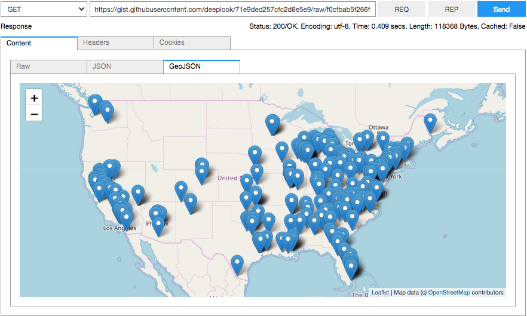

# Ipyrest

[](http://beta.mybinder.org/v2/gh/deeplook/ipyrest/master) 
[](http://nbviewer.jupyter.org/github/deeplook/ipyrest/tree/master/)

Ipyrest is an emerging Jupyter notebook widget for exploring RESTful APIs. It has two main goals: provide a more convenient interface in the spirit of Postman, and allow to plug-in components, starting with output renderers for various MIME types, e.g. GeoJSON:



Features
--------

More to come...

Concepts covered:

- Server
- Service
- Request
- Response
- Data
- MIME-Type
- Compression (not explicitly, yet)
- Logging (not well enough, yet)
- Caching
- Time-Out
- Errors (our own, not yet)
- Viewing
- Plugins
- Testing
- UI

Response views (plugins):

- Text
- HTML
- Bitmaps
- SVG
- JSON
- GeoJSON
- Protobuf
- 3D ?

Main direct dependencies:

- Python >= 3.6
- jupyter (incl. lab)
- ipywidgets
- ipyleaflet
- ipyvolume
- geojson
- protobuf
- timeout_decorator
- requests
- vcr
- mypy
- pytest

Issues:

- Traitlets limitations (mainly on compound widgets)
- Text styling (`ipywidgets.HTML`), see [ipywidgets/issues/2206](https://github.com/jupyter-widgets/ipywidgets/issues/2206)
- `cesiumpy` not an `ipywidget`

Installation
------------

For the time being you can install Ipyrest either directly from GitHub or after downloading/cloning and unpacking it like this in its top-level directory:

```
pip install git+https://github.com/deeplook/ipyrest

pip install -e .
```

Testing
-------

Just make sure you have `pytest` installed and run `PYTHONPATH=. pytest -s -v tests` in the root directory. Some tests will be skipped if you have not started a local webserver before with  `python tests/api_server.py` which implements a set of sample API endpoints for local testing. Some tests need keys/tokens defined as environment variables for the respective APIs being tested.

Documentation
-------------

The `docs` folder is only a stub for now. At the moment it is recommended to look at [`examples/meetup.ipynb`](examples/meetup.ipynb), mostly a tutorial-like collection of examples given as a presentation at a meetup. Some of these need appropriate API keys.

How to Contribute
-----------------

More to come...
